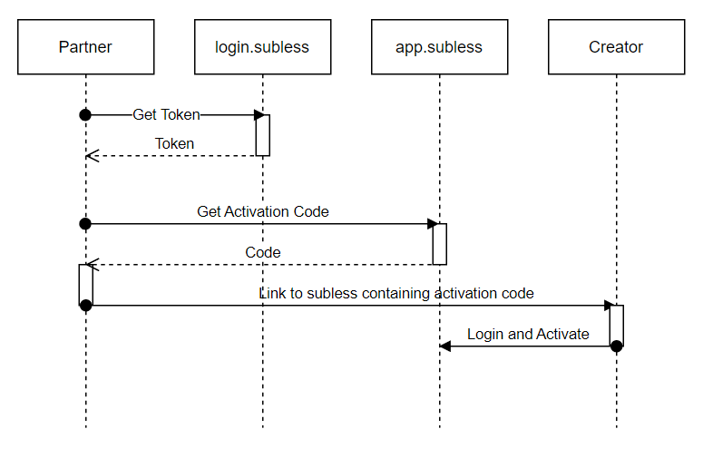

# SampleClients

Please note, subless is *currently* available for integration to only to select partners. To inquire about partnership, email contact@subless.com

There are three key integration points to make subless function with your content hosting site: 
A javascript module for login/logout and hit tracking
An API integration for registering new creators
An optional api+webhook integration for receiving and retreiving changes to creator information

## subless.js
To enable subless.js on your page, start by adding the javascript module

    <head>
        
    </head>

Embedding subless.js will allow you to make a few key requests for your integration

### login/logout
Implement login/logout by adding the respective buttons

    <button id="btnLogin" onclick="subless.sublessLogin()">Login to subless</button>
    <button id="btnLogout" onclick="subless.sublessLogout()">Logout of subless</button>

And then add a function to show/hide them based on whether the current user is logged into subless

    

Finally, call the function once the subless library has loaded

    

### hit tracking
To enable hit tracking for subless subscribers, you'll simply need to make subless.js available on pages with creator content

    <head>
        
    </head>

For hits to be registered, ***the creator username must appear in the URI***

On all pages with that module enabled, subless will be notified of the URI when a logged-in subscriber visits the page. Hits will be recorded if that creator is also registered with subless.

## Creator activation
To register a creator, you'll make an API call to us with that creator's username, receive an activation code from us for that creator, and then redirect that creator to us with that activation code

These examples use curl for clairty. To see examples in other languages, check out the sample clients.

First, call our authorization server with your partner credentials, which will return an auth token to receive an auth token

    curl --location -u '[PARTNER-ID]:[PARTNER-SECRET]' --request POST 'https://login.subless.com/oauth2/token' 
    --header 'Content-Type: application/x-www-form-urlencoded' 
    --data-urlencode 'scope=https://app.subless.com/creator.register' 
    --data-urlencode 'grant_type=client_credentials'

Once you have your token, call our API with the creator username and the token you just received. This will return a creator activation code.

    curl --location 
    --header Authorization: Basic [AUTH-TOKEN]
    --request POST 'https://app.subless.com/api/Partner/CreatorRegister?username=[CREATOR-USERNAME]' 

Finally, redirect the creator to subless with their activation code:

    window.href = https://app.subless.com/login?activation=[CREATOR-ACTIVATION-CODE]&postActivationRedirect=[YOUR-WEBSITE-URL]

The activation code is time sensitive, so we recommend you only generate it once the creator clicks a button to begin the subless activation.

## Optional features

### Webhooks

### Creator Status Display