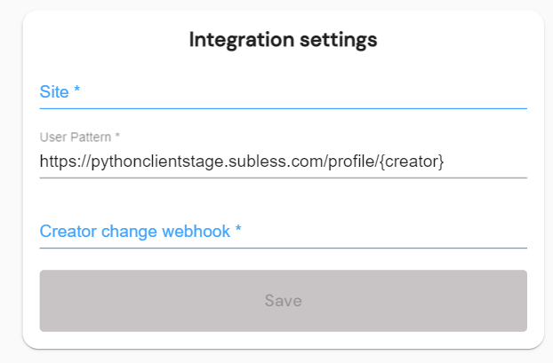

# SampleClients

Please note, subless is *currently* available for integration to only to select partners. To inquire about partnership, email contact@subless.com

There are three key integration points to make subless function with your content hosting site: 
* A javascript module for login/logout and hit tracking
* An API integration for registering new creators
* An optional api+webhook integration for receiving and retreiving changes to creator information

## subless.js
To enable subless.js on your page, start by adding the javascript module

    <head>
        
    </head>

Embedding subless.js will allow you to make a few key requests for your integration

### login/logout
Implement login/logout by adding the respective buttons

    <button id="btnLogin" onclick="subless.sublessLogin()">Login to subless</button>
    <button id="btnLogout" onclick="subless.sublessLogout()">Logout of subless</button>

And then add a function to show/hide them based on whether the current user is logged into subless

    

Finally, call the function once the subless library has loaded

    

### hit tracking
To enable hit tracking for subless subscribers, make subless.js available on pages with creator content

    <head>
        
    </head>

For hits to be registered, ***the creator username must appear in the URI***

On all pages with that module enabled, subless will be notified of the URI when a logged-in subscriber visits the page. Hits will be recorded if that creator is also registered with subless.

## Creator activation
To register a creator, you'll make an API call to us with that creator's username, receive an activation code from us for that creator, and then redirect that creator to us with that activation code

These examples use curl for clairty. To see examples in other languages, check out the sample clients.

First, call our authorization server with your partner credentials, which will return an auth token to receive an auth token

    curl --location -u '[PARTNER-ID]:[PARTNER-SECRET]' --request POST 'https://login.subless.com/oauth2/token' 
    --header 'Content-Type: application/x-www-form-urlencoded' 
    --data-urlencode 'scope=https://app.subless.com/creator.register' 
    --data-urlencode 'grant_type=client_credentials'

Once you have your token, call our API with the creator username and the token you just received. This will return a creator activation code.

    curl --location 
    --header Authorization: Basic [AUTH-TOKEN]
    --request POST 'https://app.subless.com/api/Partner/CreatorRegister?username=[CREATOR-USERNAME]' 

Finally, redirect the creator to subless with their activation code:

    window.href = https://app.subless.com/login?activation=[CREATOR-ACTIVATION-CODE]&postActivationRedirect=[YOUR-WEBSITE-URL]

The activation code is time sensitive, so we recommend you only generate it once the creator clicks a button to begin the subless activation.

## Optional features

### Webhooks
Update your webhook address in your partner profile

When a creator linked to your partner account is actived on our site, a webhook will fire to that address with the following payload

            {
                Active = true,
                Email = "",
                Id = "",
                IsDeleted = false,
                PartnerId = "",
                Username = ""
            };

## Validating your partner integration

### Sign-ins and Sign-outs
Users must be able to authenticate from partner pages
* Navigate to a page on your partner site that shows the subless login button
* Click the subless login button
* **Verify you are redirected to the subless login page**
* Sign into an existing subless account, or create a new one
* Return to your partner site
* **Verify that the subles sign-in button is no longer visible**
* **Verify that the subles sign-out button is visible**
* Click the subless sign out button
* **Verify that the subles sign-out button is no longer visible**
* **Verify that the subles sign-in button is visible**

### Creator registration
Creators must be able to link thier partner accounts to their subless accounts
* Sign into a creator account
* Click the button to link your creator to a subless account
* **Verify you are redirected to the subless login page**
* Create a new subless account, or sign into an existing one
* **Verify you are prompted to enter a payout address**
* **Verify you are *not* prompted to pay for subless**
* Enter a payout email address and click save
* **Verify you are redirected back to your parter site**

### Hit registration
Patrons must be able to have visits to creators on your site registered for their monthly payouts
* Register a creator as described above
* Sign out of your creator account
* Create a new patron account, and register a payment. If you're in a lower environment, you can use the [card info for stripe testing](https://stripe.com/docs/testing#testing-interactively)
* While logged in with that patron, visit some content on your site posted by the creator you registered
* Visit the subless profile of your patron account, (for example, https://app.subless.com/user-profile in production)
* **Verify that your "content views this month" have a nonzero value**
* Visit the creator content again, refreshing the page if it's still open
* **Verify that "content views this month" have increased by one**
